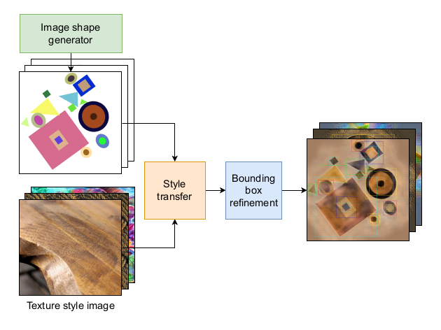

# ⚡️ YOLO v10‑SynCircle

---

## 📜 Abstract
Circle detection plays a pivotal role in computer vision, underpinning applications from industrial inspection and bio‑informatics to autonomous driving. Traditional methods often struggle with real‑world complexities, as they demand extensive parameter tuning and adaptation across different domains.  
We introduce the **Synthetic Circle Dataset (SynCircle)** together with a **YOLO v10** model pre‑trained entirely on synthetic data. The network already performs strongly *off‑the‑shelf* and can be boosted further via light fine‑tuning on a small set of real images.

Both the model weights and the full dataset are released to foster reproducibility and quick adoption.

<figure>
  
  <figcaption><strong>Figure 1.</strong> Synthetic image generation procedure: the image shape generator creates images containing random shapes placed on a uniform background. A style‑transfer step is then applied to introduce diverse textures and colours. Finally, a bounding‑box refinement stage adjusts the target annotations to account for any alterations introduced during the style‑transfer process.</figcaption>
</figure>

---

## 🗂 Repository layout

```
SynCircle/
├─ datasets/                  # tiny demo subset for quick tests
├─ weights/
│   └─ pretrain_synCircle.pt  # YOLO v10 weights pre-trained on synthetic data
├─ results/                   # inference & fine-tuning outputs
├─ train.py                   # fine-tuning script
├─ test.py                    # quick installation check
├─ LICENSE
└─ README.md                  # you are here
```

---

## 📦 Dataset

| Split | Download |
|-------|----------|
| Train | [Google Drive](https://drive.google.com/drive/folders/19IKSid1K_WWplA_15_PYwtLJpHi5e-e9?usp=sharing) |
| Val   | [Google Drive](https://drive.google.com/drive/folders/121t169YCGJSIItXb9yNEWBCNJvSoU1b4?usp=drive_link) |
| Test  | [Google Drive](https://drive.google.com/drive/folders/1ILCsDDrtEjZxobFDLHPX1q1lLjSOeExG?usp=drive_link) |


---

## 🚀 Quick start

### 1. Create a clean environment and install Ultralytics

```bash
conda create -n synCircle python=3.10 -y
conda activate synCircle
# 2. Install dependencies
pip install torch==2.5.1+cu118 \
            torchvision==0.20.1+cu118 \
            torchaudio==2.5.1 \
            --index-url https://download.pytorch.org/whl/cu118
pip install ultralytics==8.2.103
```

### 2. Clone the repository & enter it

```bash
git clone https://github.com/pandrein/SynCircle.git
cd SynCircle
```

### 3. Sanity‑check the installation

Run the model on a small demo set in `./datasets`; results land in `./results`.

```bash
python3 test.py   --weights weights/pretrain_synCircle.pt   --source ./datasets/demo
```

### 4. Evaluate on your dataset

```bash
python3 test.py   --weights weights/pretrain_synCircle.pt   --source <path/to/images>
```

Add `--no-eval` if ground‑truth labels are missing.

### 5. Fine‑tune on **your** dataset

```bash
python3 train.py   --data path/to/your/data.yaml   --epochs 20   --lr 1e-4   --val_split 0.4        # 60 % train / 40 % val
```

All artefacts (logs, checkpoints, predictions) are written to `./results/<run-name>`.

---

## 📝 License
Code, dataset and weights are released under the **GNU Affero General Public License v3.0**.  
For closed‑source or commercial usage without the AGPL obligations, contact **Ultralytics** for an Enterprise Licence.

---

## 📄 Citation

<!-- Add your BibTeX here -->
